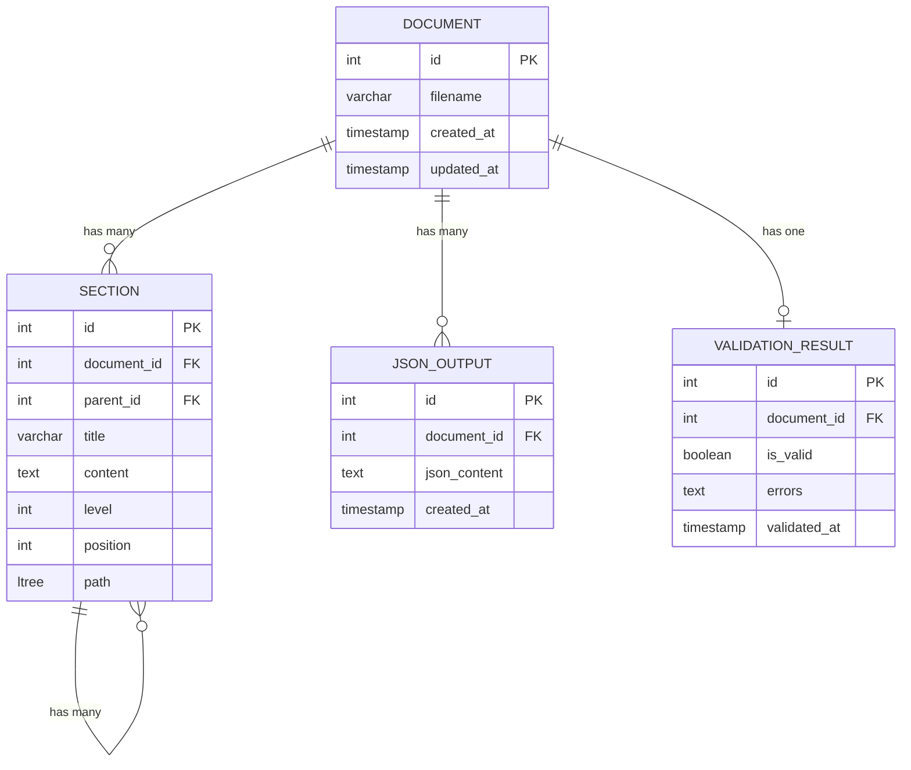
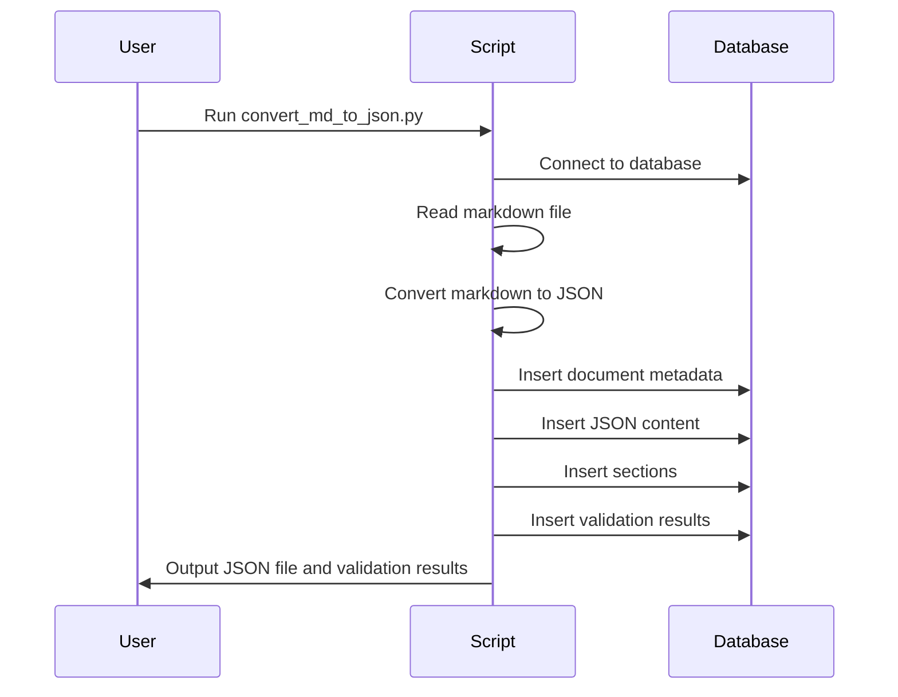
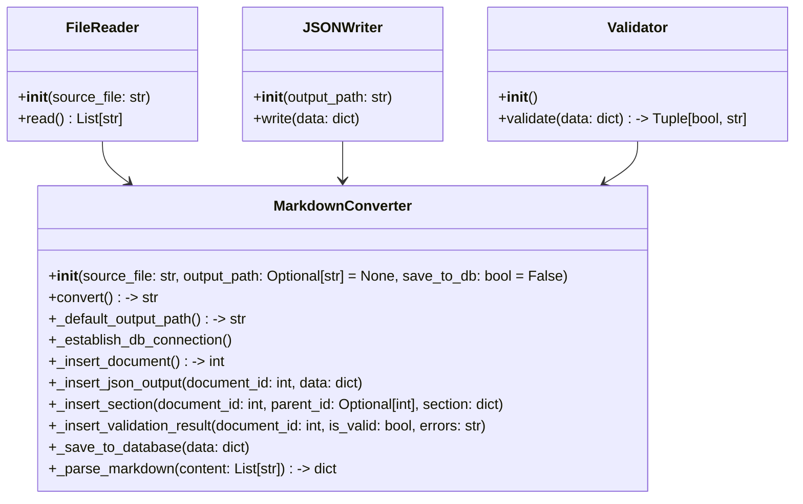

# Project README

## Testing Before Integration
Thoroughly test the script before integrating it into your backend framework (e.g., FastAPI, Flask, Django, etc.).

## Adjustments for ORM Integration
Modify the script to ensure compatibility with your ORM (e.g., SQLAlchemy, Django ORM, or any other ORM in use).

## Script Purpose
The script serves the following purposes:

### Markdown to JSON Conversion
- Converts Markdown (`.md`) files into JSON format.
- Imports the converted data into a PostgreSQL database to achieve the following:
  1. Retrieve stored data from the database and loop through it to allow an AI agent to efficiently divide tasks, enhancing overall efficiency and reliability.
  2. Upcoming Feature: Update the script to support embedding files into a vector database, accommodating a more dynamic range of file types (e.g., PDF, XML, HTML, DOCX, Excel, CSV, etc.).

## Mermaid Diagrams

### Database Schema
The database schema includes the following tables:
- `DOCUMENT`: Stores document metadata such as filename, creation timestamp, and update timestamp.
- `SECTION`: Stores sections of the document, including title, content, level, position, and hierarchical path.
- `JSON_OUTPUT`: Stores the JSON content of the document.
- `VALIDATION_RESULT`: Stores the validation results of the document.

The relationships between the tables are as follows:
- A `DOCUMENT` can have many `SECTION` entries.
- A `SECTION` can have many child `SECTION` entries.
- A `DOCUMENT` can have many `JSON_OUTPUT` entries.
- A `DOCUMENT` can have one `VALIDATION_RESULT` entry.


```

### Sequence Diagram
The sequence diagram illustrates the flow of data and interactions between the components of the script.



### Class Diagram
The class diagram includes the following classes:
- `FileReader`: Reads the content of a file.
- `JSONWriter`: Writes JSON content to a file.
- `Validator`: Validates JSON content against a schema.
- `MarkdownConverter`: Converts markdown files to JSON and optionally saves the output to a database.

The relationships between the classes are as follows:
- `MarkdownConverter` uses `FileReader` to read the content of the markdown file.
- `MarkdownConverter` uses `JSONWriter` to write the JSON content to a file.
- `MarkdownConverter` uses `Validator` to validate the JSON content.



## Contact
Feel free to contact me to achieve group and new ideas.
