# Markdown to JSON Database Converter

[](LICENSE)
[](https://www.python.org/downloads/)
[](https://www.postgresql.org/)

## Table of Contents
1. [Overview](#overview)
2. [System Architecture](#system-architecture)
3. [Component Documentation](#component-documentation)
4. [Installation & Setup](#installation--setup)
5. [Usage Guide](#usage-guide)
6. [Development Guide](#development-guide)
7. [API Reference](#api-reference)
8. [Testing](#testing)
9. [Contributing](#contributing)
10. [License & Contact](#license--contact)

## Overview

A robust Python-based system designed to convert Markdown documents into structured JSON while persisting the data in a PostgreSQL database. The system maintains document hierarchy, supports nested sections, and ensures data integrity through comprehensive validation.

### Key Features
- Markdown to JSON conversion with hierarchy preservation
- Robust validation system with detailed error reporting
- PostgreSQL database integration with ACID compliance
- Support for nested document sections
- Comprehensive error handling and reporting

## System Architecture

### Use Case Overview

The following diagram illustrates the system's primary use cases and interactions:

```mermaid
flowchart TB
    %% Actors
    User(("👤 User"))
    System(("⚙️ System"))
    Database[("🗄️ Database")]

    %% System Boundary
    subgraph Markdown to JSON System
        %% Primary Use Cases
        Convert["📄 Convert Markdown to JSON"]
        Validate["✅ Validate Document"]
        SaveDB["💾 Save to Database"]
        
        %% Validation Use Cases
        subgraph Validation System
            direction TB
            ValidateSchema["🔍 Schema Validation"]
            ValidateContent["📝 Content Validation"]
            ValidateStructure["🌳 Structure Validation"]
            FormatErrors["❌ Error Formatting"]
        end

        %% Database Use Cases
        subgraph Database Operations
            direction TB
            SaveDoc["📋 Save Document"]
            SaveSections["📑 Save Sections"]
            SaveJSON["🔄 Save JSON"]
            SaveValidation["📊 Save Results"]
        end
    end

    %% Relationships
    User --> Convert
    Convert --> Validate
    Validate --> ValidateSchema
    Validate --> ValidateContent
    Validate --> ValidateStructure
    ValidateSchema --> FormatErrors
    ValidateContent --> FormatErrors
    ValidateStructure --> FormatErrors
    
    Convert --> SaveDB
    SaveDB --> SaveDoc
    SaveDB --> SaveSections
    SaveDB --> SaveJSON
    SaveDB --> SaveValidation
    
    SaveDoc --> Database
    SaveSections --> Database
    SaveJSON --> Database
    SaveValidation --> Database
    
    %% Add descriptions using native styling
    Convert -. "1. Reads markdown file<br/>2. Parses content<br/>3. Generates JSON" .-> System
    Validate -. "1. Schema validation<br/>2. Content validation<br/>3. Structure validation" .-> System
    SaveDB -. "1. Document metadata<br/>2. Section hierarchy<br/>3. JSON output<br/>4. Validation results" .-> System
```



### Component Architecture

The system is built using a modular architecture with clear separation of concerns:


### Database Schema

The system uses a PostgreSQL database with the following schema:


### Processing Flow

The sequence diagram below illustrates the system's processing flow:


## Component Documentation

### Validation System

The validation system follows the Strategy pattern with three main validators:

1. **Schema Validator**
   - Validates document structure against defined schema
   - Checks field presence and types
   - Ensures required fields exist

2. **Content Validator**
   - Validates content values
   - Checks for empty/invalid content
   - Ensures content format compliance

3. **Structure Validator**
   - Validates document hierarchy
   - Ensures proper section nesting
   - Validates level relationships

### Error Handling

The system uses a unified error handling approach:

1. **Error Formatter**
   - Provides consistent error message formatting
   - Supports multiple error types
   - Includes context in error messages

2. **Validation Error**
   - Encapsulates error information
   - Provides detailed error context
   - Supports error propagation

## Installation & Setup

### Prerequisites
- Python 3.8+
- PostgreSQL 13+
- Required Python packages:
  ```bash
  pip install -r requirements.txt
  ```

### Database Setup
1. Create PostgreSQL database:
   ```sql
   CREATE DATABASE mcp;
   ```

2. Configure environment:
   ```bash
   # Linux/macOS
   export DB_HOST=localhost
   export DB_PORT=5432
   export DB_NAME=mcp
   export DB_USER=your_username
   export DB_PASSWORD=your_password

   # Windows
   set DB_HOST=localhost
   set DB_PORT=5432
   set DB_NAME=mcp
   set DB_USER=your_username
   set DB_PASSWORD=your_password
   ```

3. Initialize database:
   ```bash
   python database/import_schema.py
   ```

## Usage Guide

### Basic Usage
```python
from markdown_converter import MarkdownConverter

# Initialize converter
converter = MarkdownConverter(
    source_file="path/to/markdown.md",
    save_to_db=True
)

# Convert and save
output_path = converter.convert()
```

### Advanced Usage
```python
# Custom output path
converter = MarkdownConverter(
    source_file="input.md",
    output_path="custom/path/output.json",
    save_to_db=True
)

# Convert with validation
output_path = converter.convert()
```

## Development Guide

### Project Structure
```
markdown_converter/
├── __init__.py
├── markdown_converter.py
├── validators/
│   ├── base/
│   │   ├── base_validator.py
│   │   └── error_handler.py
│   ├── schema_validator.py
│   ├── content_validator.py
│   └── structure_validator.py
└── database/
    ├── base_handler.py
    └── handlers/
```

### Adding New Validators
1. Extend `ValidationStrategy`
2. Implement `validate()` method
3. Use `ErrorFormatter` for messages
4. Register in `Validator` class

## Testing

### Unit Tests
```bash
python -m pytest tests/
```

### Integration Tests
```bash
python run_tests.py
```

## Contributing
Please read [CONTRIBUTING.md](CONTRIBUTING.md) for contribution guidelines.

## License & Contact

### License
This project is licensed under the MIT License - see the [LICENSE](LICENSE) file for details.

### Contact
- **Author**: Tariq Ahmed
- **Email**: t.ahmed@stride.ae
- **Organization**: Stride Information Technology
